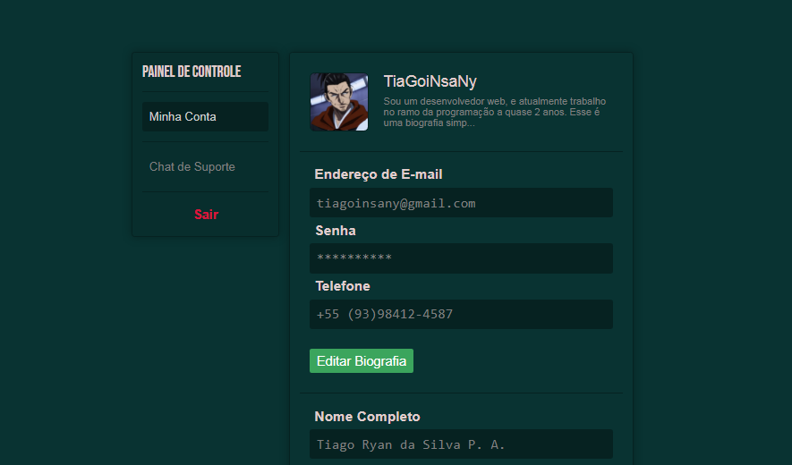

# :computer: Painel de Controle Simples

Esse é um pequeno projeto que fiz enquanto estava sem internet, onde fiz um simples painel de controle mostrando as informações do usuário e um Chat para conversar com um membro de Suporte.

Atualmente não implementei nenhum servidor ou websocket, apenas fiz o modelo de interface. Espero que gostem! :heart: